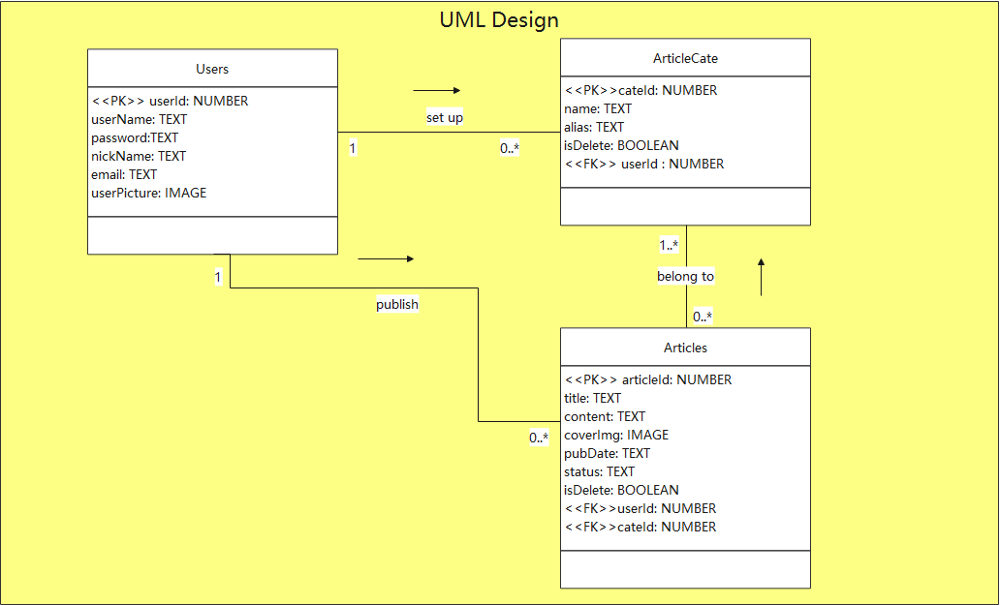
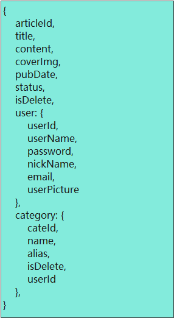
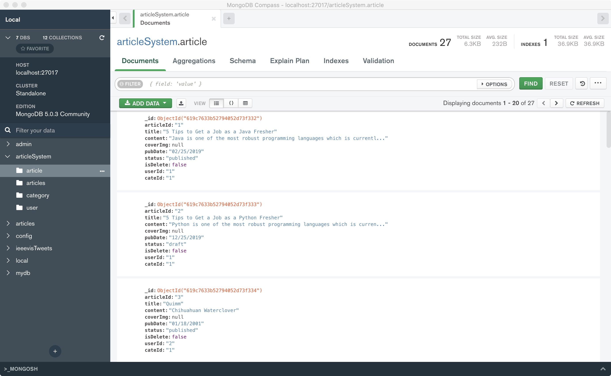
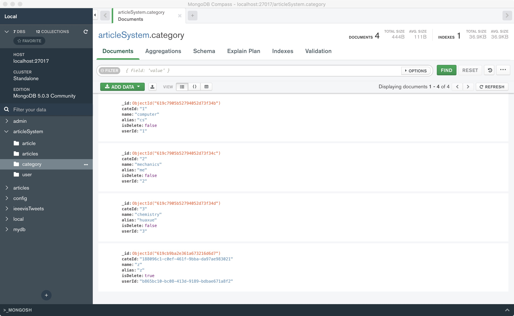

# Article management system(MongoDB)

Jinxin Hu:

	Completed the sign-up and log-in part;
	
	Completed other auxiliary functions like getting user basic information and updating password;

Wenrui Fang:

	Wrote the page of homepage part;
	
	Wrote the code of article category, article list and article deleting parts;

The diagram on the homepage is not the content of this project. It is just a sample display.

## User Story

David wants to have a platform where he can record and publish his thoughts. He can record the knowledge he learns in his life, the news he hears about and his views on these things in this article management system. The article management system needs to have the function of classification retrieval. David can also add new categories he wants so that he can choose to publish the article to the appropriate category.

## Business Requirements

Users can register a new account.

The user should log in to the account.

Users can add the article category they want to publish.

Users can post articles.

Users can view their basic information.

The user can set up and change the profile photo.

Users can reset their own password.

Article needs to have an author

Articles need to have at least one classification

Article needs to have a title

The article needs to have a body

Articles can be published

The article can have a cover image

The article category needs to have an alias

**Nouns**: Users , Articles,  Article Category

**Verbs**: record, publish

**Attribs**: Users(username, password, nickname, email, profile photo), Article Category(name, alias), Articles(title, content, cover image, publication date, status)

## Conceptual Model(UML)



## Logical Data Model



### Main Collections 

### Table 1:article(article only table)

"articleId": Article Id.

"title":  Article title.

 "content":  Article content.

 "coverImg": Image which user want to set up.

 "pubDate": Article publication time

  "status":  Indicates whether the article is published or not

  "isDelete": The status of the article, whether it has been deleted

  "userId": User Id

  "cateId":  Category id

**Example:** 

```json
{
      "articleId": "1",
      "title": "5 Tips to Get a Job as a Java Fresher",
      "content": "Java is one of the most robust programming languages which is currently used for development in 3 billion devices. This language offers amazing features like platform independence, object-oriented programming, enhanced security features, automatic garbage collection, and many more. The latest technological trends of 2021 completely manifest that Java will continue to behold its dominance in the upcoming future. The rise of Java is linked with the growth of job opportunities for",
      "coverImg": null,
      "pubDate": "02/25/2019",
      "status": "published",
      "isDelete": false,
      "userId": "1",
      "cateId": "1"
    }
```

### Table 2: user (user only table)

"userId":  User id.

"userName":  Username for user.

"password":  Encrypted password.

"nickName":  Nick name for user.

"email":  Email which user set up.

"userPicture":  Profile picture.

**Example:**

```json
{
    "_id": {
        "$oid": "619c5b5375777fbf467a55e8"
    },
    "userId": "ef68f598-1f9b-43ee-be93-c229c21b03f8",
    "userName": "aaab",
    "password": "$2a$10$94Lw6j0IIWRnHhex/QurfefBou/naaIbhdkEFV2G4.HyUg8XXVbWu",
    "nickName": "AAABB",
    "email": "aaab@gmail.com",
    "userPicture": null
}
```

### Table 3: category(category only table)

"cateId":  Category id.

"name":  Category name.

"alias":  Another way of saying category.

"isDelete": Whether the category is deleted.

"userId": User Id.

**Example:**

```json
{
    "cateId": "3",
    "name": "chemistry",
    "alias": "huaxue",
    "isDelete": false,
    "userId": "3"
}
```

### Table 4: articles(main table)

The main table formed by combining the above three tables.

```json
{
    "articleId": "1",
    "title": "5 Tips to Get a Job as a Java Fresher",
    "content": "Java is one of the most robust programming languages which is currently used for development in 3 billion devices. This language offers amazing features like platform independence, object-oriented programming, enhanced security features, automatic garbage collection, and many more. The latest technological trends of 2021 completely manifest that Java will continue to behold its dominance in the upcoming future. The rise of Java is linked with the growth of job opportunities for",
    "coverImg": null,
    "pubDate": "02/25/2019",
    "status": "published",
    "isDelete": false,
    "user": {
      "userId": "1",
      "userName": "aaa",
      "password": "123456",
      "nickName": "AAA",
      "email": "aaa@gmail.com",
      "userPicture": null
    },
    "category": [
      {
        "cateId": "1",
        "name": "computer",
        "alias": "cs",
        "isDelete": "false",
        "user": {
          "userId": "1",
          "userName": "aaa",
          "password": "123456",
          "nickName": "AAA",
          "email": "aaa@gmail.com",
          "userPicture": null
        }
      }
    ]
  }
```

### Successful create table






### Testing table is work

```javascript
//1. Get all articles whose status are draft.
db.getCollection("articles").aggregate([{ $match: { status: "draft" } },])

//2. Get three articles whose status are published.
db.getCollection("articles").aggregate([{ $match: { status: "published" } }, {$limit: 3}])

//3. Count the number of articles for the user with userId=1.
db.getCollection("articles").find({ "user.userId": "1" }).count()

//4. Set the "isDelete" of the article whose articleID=1 to true.
db.getCollection("articles").aggregate([{$match: {articleId: "1"}}, {$set: {isDelete: true}}])

//5. Find articles which are written by the user(userId=1) and belong to the computer category.
db.getCollection("articles").find(
    {
        $and: [
            { "user.userId": "1" }, { "category.name": "computer" }
        ]
    }
)
```


## How to Start

Download and install [MongoDB](https://docs.mongodb.com/manual/installation/) follow this instruction

Import the file using mongoimport

```
mongoimport --db articleSystem --collection category --file article.json --jsonArray   
mongoimport --db articleSystem --collection category --file articles.json --jsonArray   
mongoimport --db articleSystem --collection category --file category.json --jsonArray   
mongoimport --db articleSystem --collection category --file user.json --jsonArray   
```

Download nodejs and install

Download link: https://nodejs.org/dist/v8.9.4/node-v8.9.4-x64.msi

Download main from https://github.com/hujinxinchengdu/Article-management-system

For backend first of all go the backend folder

```
cd backend
```


Open the console and enter commands to install related dependencies

```
npm install
```

Enter the following command in the vscode console:

```
nodemon app.js
```

If do not have nodemon you should install it by following command

```
npm install -g nodemon
```

For Frontend using vscode live sever--run server using login.html

https://www.youtube.com/watch?v=7xchuqcsncY
